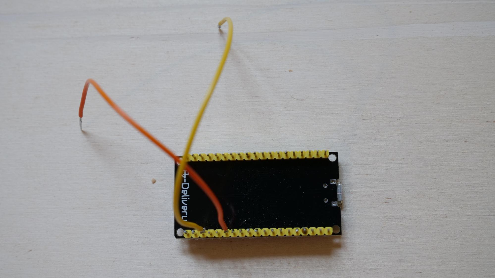

Work in progress, heavily stolen from https://wiki.natenom.de/verkehr/projekte/abstandsmesser/openbikesensor/faq

 

# OpenBikeSensor FAQ

## Allgemein

  
Was ist der OpenBikeSensor? (Click to expand)

  Der OpenBikeSensor (ehemals RadmesserS) wird am Fahrrad befestigt und misst verschiedene Daten, wie z. B. den Abstand beim Überholtwerden, und speichert diese. Sowohl die Hardwarespezifikation als auch die verwendete Software sind frei verfügbar. Jeder Interessierte kann somit den OpenBikeSensor selbst bauen und nutzen.

    
Gibt es das nicht schon? (Click to expand)

    Es gibt mehrere solcher Projekte; z. B. „Radmesser vom Tagesspiegel“, „Abstand messen“ aus Köln, FIXME, FIXME.

## Kann ich den OpenBikeSensor kaufen?

Nein; ein Vertrieb ist nicht geplant. Du musst dir den OpenBikeSensor entweder selbst bauen oder jemanden dafür bezahlen, dass er ihn für dich baut.
Kann ich den OpenBikeSensor selbst bauen?

Ja, wenn du die notwendigen technischen Fertigkeiten hast. Die Bauanleitung gibt es hier als PDF-Datei.
Könnt Ihr mir dabei helfen?

Wir bekommen viele Anfragen, mit der Bitte, beim Bau des OpenBikeSensors zu unterstützen. Aktuell arbeiten nur wenige Menschen an dem Projekt OpenBikeSensor mit, ehrenamtlich und in ihrer Freizeit.

Bitte hab Verständnis dafür, dass wir nur ausnahmsweise, wenn überhaupt, auf solche Anfragen eingehen können.
Kann ich jemanden bezahlen, den OpenBikeSensor für mich zu bauen?

Ja; FIXME wer, vermittlung an Menschen, die das können?
Wieviel kostet der OpenBikeSensor?

    30-40€ für die Bauteile, je nach Versandkosten.
    <5 € Material fürs Gehäuse
    + eventuelle Kosten fürs Druckenlassen des Gehäuses
    + eventuelle Kosten fürs Zusammenbauen lassen

Wo bekomme ich die Bauteile für den OpenBikeSensor?

    Gehäuse drucken lassen in Makerspaces?
    FIXME

